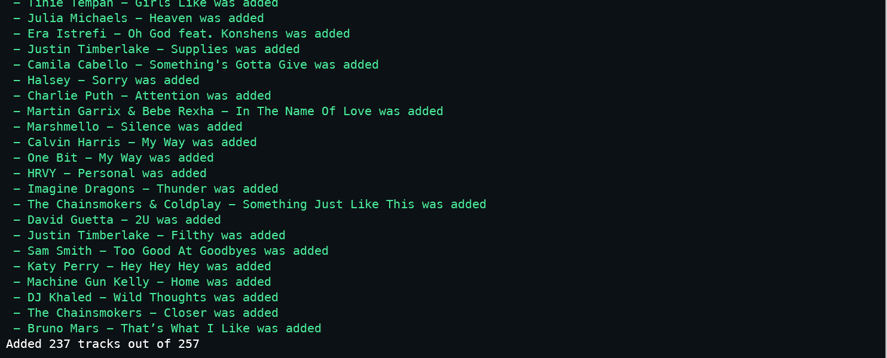

# Youtube To Spotify 🎵
Utility script to transfer songs from a Youtube playlist to a Spotify one.

## Results


## Setup Spotify and Youtube 👨‍🔧

- Create a app [https://developer.spotify.com/dashboard/applications](https://developer.spotify.com/dashboard/applications)
- Set redirect uri to http://localhost:8888/callback
- Copy the Client Id and Client Secret
- To get your spotify User Id
    - Click on your profile and Copy the spotify URI
    - Copy the random String after `spotify:user:`

- The first step is to log in or create an account on https://developers.google.com/.
- When you log in into your account, follow this link https://console.developers.google.com/project and `CREATE PROJECT` by clicking on the blue button.
*Wait a few seconds for Google to prepare your project*.

- Google API Console - Create Project Fill in the name you want to assign to your project.
- On the top left corner, click the Google APIs link and then follow the link option dubbed “YouTube DATA API”.
- Now select the “ENABLE” button which manifests after you click the YouTube DATA API link.
- Now click the blue button on the far right with the `Create Credentials` phrase.
- Select `Credentials` on the left sidebar and copy your API Key

### Setting Environment Variables Mac and Linux

- Rename the file `.sample.env` to `.env`
- Edit the file by adding your credentials

### Setting Environment Variables (Windows)
```
set SPOTIFY_USER_ID <your_user_id>
set SPOTIFY_CLIENT_ID <your_client_id>
set SPOTIFY_CLIENT_SECRET <your_client_secret>
set API_KEY <your_youtube_api_key>
```

## Download and Install

Copy the ZIP file from [here](https://github.com/AnimeshRy/yt2spot/archive/refs/heads/main.zip)
**OR**
```sh
# Clone the repo
$ git clone git@github.com:AnimeshRy/yt2spot.git
```
```sh
# if pipenv available ?
$ pipenv shell
# if not
$ pip install -r requirements.txt
```

## Usage
```sh
$ python main.py
# output
Enter Youtube Playlist Id:
Name Spotify Playlist:
...
```

### Thanks
- [Spotipy](https://github.com/plamere/spotipy)
- [Youtube Title Parse](https://github.com/lttkgp/youtube_title_parse)

[MIT LICENSE](./LICENSE)

#### Built with 💙 by [Animesh Singh](https://www.github.com/AnimeshRy)


